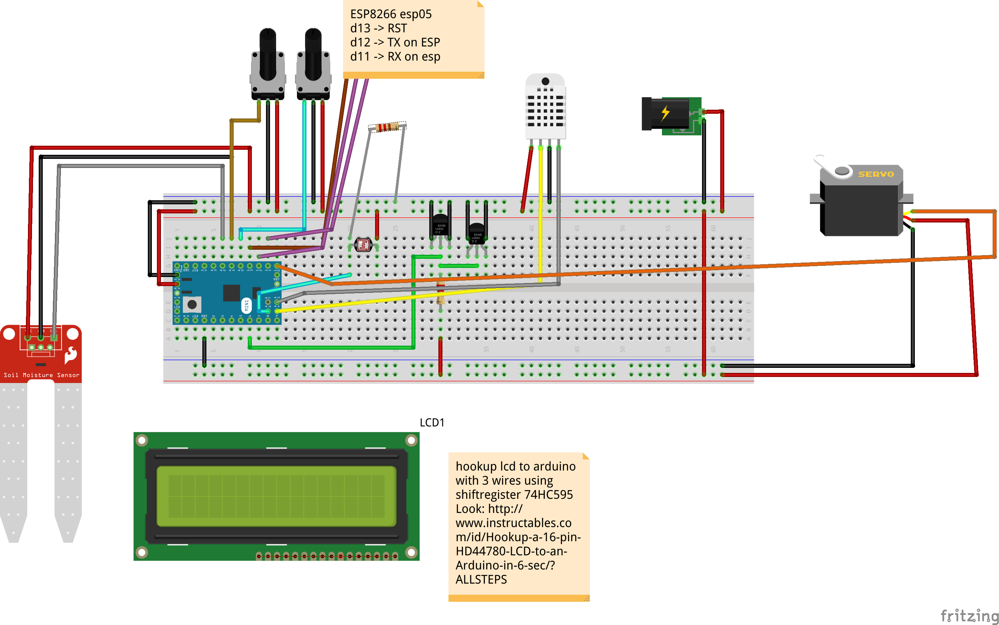

# Greenhouse Project #

This project contains source and frizing of a project to automate a small greenhouse.

### What is this repository for? ###

* Quick summary
* Version
* [Learn Markdown](https://bitbucket.org/tutorials/markdowndemo)

### How do I get set up? ###

### Who do I talk to? ###

* author jontte

    2 Pull requests
    21 Issues
    Downloads

Settings

    tutorials account
    MarkdownDemo

Overview
SSH
Watch

Last updated
    22 hours ago 
Fork of
    DACOFFEY/WIKI 
Language
    — 
Access level
    Read 

    1 Branch 0 Tags 86 Forks 309 Watchers 

Bitbucket Supported Markdown for READMEs, comments, and Wiki

Markdown for readmes is pretty popular. So, I've given you a demo here of all the markup we support. In some cases, I copied the doc/examples entirely from the Fireball Markdown site.

I didn't duplicate all the Markdown doc everything tho. For the entire docs and a deeper explanation of Markdown, you still need to go to the Markdown site.

You can also use Bitbucket mark up in comments, issues, and commit messages.

On this page:

    Span Elements

        Emphasis

        Strikethrough

        Preformatted code

        Links

        Images

    Block Elements

        Headings

        Paragraphs and blockquotes

        Lists

        Tables

        Code and Syntax highlighting

        Horizontal rules

Bitbucket does NOT support

Please note, we don't support arbitrary HTML in Markdown, for example <table> tags. Instead, we use safe mode. Safe mode requires that you replace, remove, or escape HTML tags appropriately.
Span Elements

These elements occur within a line of text. So, for example font changes or links.
Emphasis

Markdown treats * (asterisk) and _ (underscores) as emphasis markers.

single asterisks

single underscores

double asterisks

double underscores

All are created from this:

*single asterisks*

_single underscores_

**double asterisks**

__double underscores__

You must use the same character must be used to open and close an emphasis span. Emphasis can be used in the middle of a word.

Emphasis can be used in the mi*dd*le of a word.

But if you surround an * or _ with spaces, it’ll be treated as a literal asterisk or underscore.

To produce a literal asterisk or underscore at a position where it would otherwise be used as an emphasis delimiter, you can backslash escape it:

\*this text is surrounded by literal asterisks\*

Strikethrough

Bitbucket's Markdown parser supports strikethrough by wrapping text in ~~:

text that has been struckthrough

is created from:

~~text that has been struckthrough~~

Preformatted code

To indicate a span of code, wrap it with ` (backtick). Unlike a pre-formatted code block, a code span indicates code within a normal paragraph. For example:

Use the printf() function.

is produced from:

Use the `printf()` function.

To include a literal backtick character within a code span, you can use multiple backticks as the opening and closing delimiters:

There is a literal backtick (`) here.
Links

Markdown supports inline and reference links. In both styles, the link text is delimited by [square brackets]. To create an inline link, use this syntax:

[ Text for the link ](URL)

So an inline link to Yahoo looks like this:

So an inline link to [Yahoo](http://www.yahoo.com) looks like this:

Reference-style links use a second set of square brackets, inside which you place a label of your choosing to identify the link:

This is [an example][id] reference-style link.

Which gives you a link like this:

This is an example reference-style link.

Elsewhere in the document, usually at the bottom of the file, you define your link label on a line by itself:

[id]: http://example.com/  "Optional Title Here"

Links can get pretty fancy, so if you want the long form version, visit the official Markdown docs.
Images

Markdown uses an image syntax that is intended to resemble the syntax for links, allowing for two styles: inline and reference. Images appear like this:

Alt text

