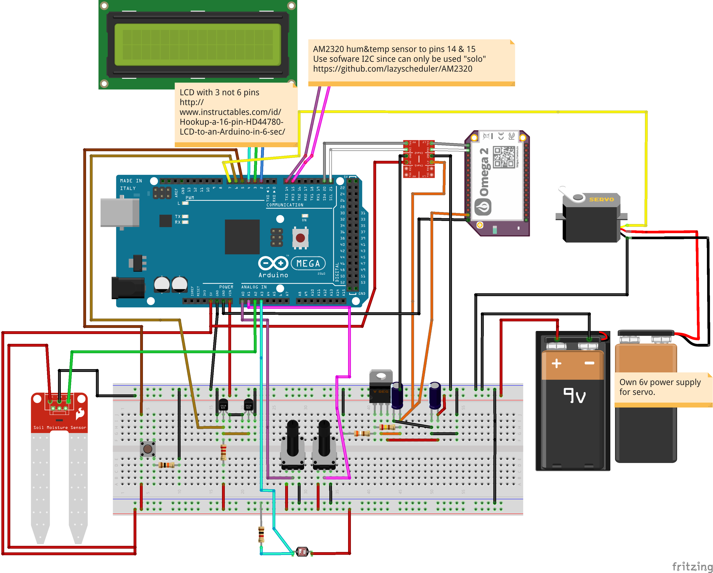

# Greenhouse Project #

This project contains source and fritzing of a project to automate a small greenhouse. For now, the soil-moisture probe is not "stable" enough, so automatic watering is not yet implemented. The current version does not contain a web-server, but sends data to thingspeak instead.

### Greenhouse repository ###
* source code for arduino microcontroller (first versions for pro mini, and later for mega)
* source code for one chip pic's, like Omega2 
* simplified fritzing picture of project.

### How do I get set up? ###
No special set-ups needed. Connect necessary devices and sensors to a arduino (project uses now Mega 2560 clone, but any other should work just fine, but be aware of memory requirements)

A simplified fritzing pic about the project:

